# Automated Static Website Deployment with PR Previews

## Overview

This project implements a fully automated CI/CD pipeline for deploying a static website to **AWS S3** and **CloudFront** using **GitHub Actions**.
The pipeline deploys the website automatically when pull requests are merged into the `main` branch and provides PR preview environments for validation.

---

## Architecture Diagram

```mermaid
graph TD
    subgraph Local_Machine ["💻 Local Machine"]
        Dev((Developer))
    end

    subgraph GitHub ["GitHub Cloud"]
        Repo[Repository]
        Action["GitHub Actions<br/>(CI/CD Pipeline)"]
    end

    subgraph Trello_Board ["📋 Trello Board"]
        CI_List["🧪 CI Status List"]
        Deploy_List["🚀 Deploy Status List"]
    end

    subgraph AWS ["☁️ AWS Cloud"]
        S3["S3 Bucket<br/>(Private Storage)"]
        CF["CloudFront CDN<br/>(Public Distribution)"]
    end

    User((End User))

    %% Flows
    Dev -- "1. Push Code (git push)" --> Repo
    Repo -- "2. Trigger Event" --> Action
    Action -- "3. Lint & Test" --> Action
    Action -.->|"4. Notify (Pass/Fail)"| CI_List
    Action -- "5. Sync Files" --> S3
    Action -- "6. Invalidate Cache" --> CF
    Action -.->|"7. Notify (Success)"| Deploy_List
    CF -- "8. Fetch Content (OAC)" --> S3
    User -- "9. HTTPS Request" --> CF

    classDef trello fill:#0079bf,stroke:#fff,stroke-width:2px,color:#fff;
    class Trello_Board,CI_List,Deploy_List trello;
```



---

## Project Goals

* Deploy a static website to **AWS S3 + CloudFront**.
* Automate deployments using **GitHub Actions**.
* Run linting and automated tests on every pull request.
* Provide preview URLs for PR review.
* Invalidate CloudFront caches automatically after deployment.
* Maintain a clean and reliable DevOps workflow.

---

## Features

* Continuous integration (linting + tests)
* Continuous deployment to AWS
* Pull request preview environments
* Cache invalidation via CloudFront
* Branch-based workflow (`feature → main`)
* Automated feedback via GitHub Actions comments

---

## Prerequisites

### Tools

* Git
* GitHub account
* AWS account
* AWS CLI installed and configured:

```bash
aws configure
```

### AWS Requirements

Create and note the following:

* S3 bucket (private)
* CloudFront distribution
* Origin Access Control (OAC)
* IAM user or role with permissions:

  * `s3:PutObject`
  * `s3:ListBucket`
  * `s3:DeleteObject`
  * `cloudfront:CreateInvalidation`

### GitHub Secrets

Add these secrets under:

**Settings → Secrets → Actions**

```
AWS_ACCESS_KEY_ID
AWS_SECRET_ACCESS_KEY
AWS_REGION
AWS_S3_BUCKET
AWS_CLOUDFRONT_DISTRIBUTION_ID
```

(Include preview-specific bucket/prefix secrets if used.)

---

## Getting Started

### Clone the repository

```bash
git clone <repo-url>
cd <repo-folder>
```

### Install dependencies

If using a build tool (e.g. npm):

```bash
npm install
npm run build
```

### Local Development

Serve your static site locally using any tool, e.g.:

```bash
python3 -m http.server
```

or

```bash
npm run dev
```

---

## Branching Workflow

* Create a new branch:

```bash
git checkout -b feature/<name>
```

* Push the branch:

```bash
git push -u origin feature/<name>
```

* Open a pull request on GitHub.

* Merging into `main` automatically triggers deployment.

---

## CI/CD Pipeline (GitHub Actions)

### Pull Requests

When a PR is opened:

1. Linting runs
2. Tests run
3. Build runs (if required)
4. A preview environment is generated:

   * Files uploaded to an S3 preview prefix or preview bucket
5. A comment with the preview URL is posted on the PR

### Merging PRs

When a PR is merged into `main`:

1. Code is built
2. Files are synced to the production S3 bucket
3. CloudFront cache invalidation runs
4. Deployment status is posted back to GitHub

---

## Repository Structure

```
.github/
  workflows/
      deploy.yml
      pr-preview.yml
src/
public/
scripts/
README.md
```

---

## Deployment Details

### Production Deployment

Triggered by:

```
push → main
```

Actions performed:

* Build static files
* Upload to S3:

```bash
aws s3 sync ./dist s3://$AWS_S3_BUCKET --delete
```

* Invalidate CloudFront:

```bash
aws cloudfront create-invalidation \
  --distribution-id $AWS_CLOUDFRONT_DISTRIBUTION_ID \
  --paths "/*"
```

### PR Preview Deployment

Triggered by:

```
pull_request → opened, synchronize
```

Actions performed:

* Build preview environment
* Upload to preview location:

```bash
aws s3 sync ./dist s3://$AWS_S3_BUCKET/previews/$PR_NUMBER
```

* Comment on PR with the preview URL

---

## Troubleshooting

### 1. CloudFront returns 403

Cause: Missing OAC permissions
Fix: Reattach OAC to S3 bucket and update bucket policy.

### 2. Preview URL displays old content

Cause: Preview folder not overwritten
Fix: Ensure `--delete` flag is used during sync.

### 3. Deployment fails with permission error

Cause: IAM user missing S3 or CloudFront permissions
Fix: Update IAM policy and refresh GitHub Secrets.

### 4. GitHub Actions fails to authenticate to AWS

Cause: Incorrect secrets
Fix: Re-enter secrets and ensure no extra whitespace.

### 5. Cache invalidation too slow

Cause: Normal CloudFront propagation delay
Fix: No immediate fix. Use versioned files for faster updates if needed.

---

## Licence

MIT Licence.
You are free to use, modify, and distribute this project.

---

If you want, I can also generate the matching `deploy.yml` and `pr-preview.yml` GitHub Action workflows to go with this README.
